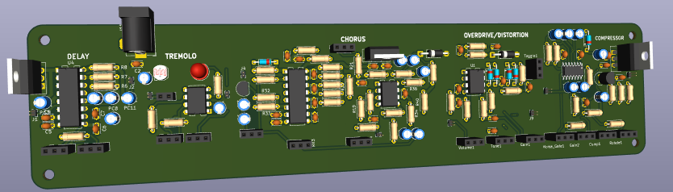
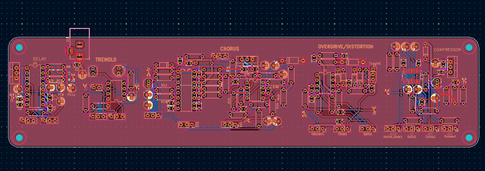

# Multi-Effects Pedal Board

A custom guitar effects pedal board consisting of multiple effects into a single unit. Designed for learning purposes.

---

## ✨ Features

- **Compressor** – Smooths dynamics and balances signal levels
- **Distortion & Overdrive** – From mild warmth to heavy saturation
- **Chorus** – Thickens and widens the sound
- **Tremolo** – Rhythmic volume modulation
- **Delay** – Adds echo and spatial depth

---

## 🧩 Signal Chain

Input → Compressor → Overdrive/Distortion → Chorus → Tremolo → Delay → Output

> _Note: Signal order can be adjusted depending on design preferences._

---

## ⚡ Power Requirements

- **Input Voltage:** 9V DC (center-negative)
- **Power Supply:** Regulated recommended
- Includes onboard regulation and decoupling for noise reduction

---

## 🔧 Hardware Overview

- Custom PCB design
- Individual circuits for each effect
- Decoupling capacitors for stable operation
- Optional microcontroller support for switching or presets

---

## 🔌 I/O

- **Input Jack:** 1/4" mono
- **Output Jack:** 1/4" mono
- **DC Jack:** 9V input

---

## 📸 Preview

