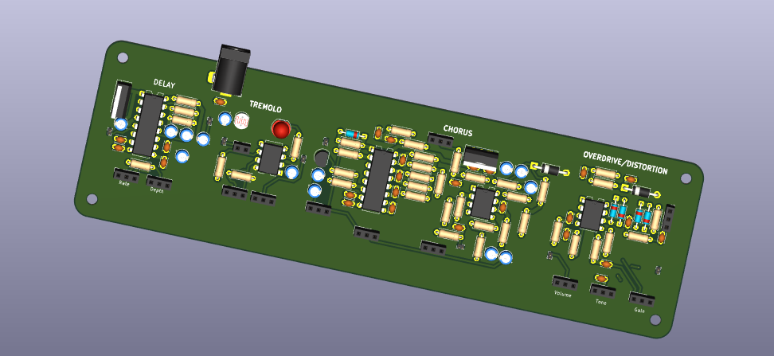
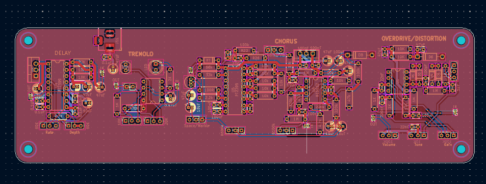

# Multi-Effects Pedal Board

A custom multi-effects guitar pedal board combining several audio effects into one compact unit. Designed primarily as a learning project to explore analog audio circuits, signal processing, and embedded control systems (obv).

Also I needed effects pedals and those things are absurdly expensive ;')

---

## Features

- **Distortion & Overdrive** – From mild warmth to heavy saturation
- **Chorus** – Thickens and widens the sound
- **Tremolo** – Rhythmic volume modulation
- **Delay** – Adds echo and spatial depth

---

##  Signal Chain

Input -> Overdrive/Distortion -> Chorus -> Tremolo -> Delay -> Output

> _Note: Signal order can be adjusted depending on design preferences._

---

## Power Requirements

- **Input Voltage:** 9V DC (center-negative)
- **Power Supply:** Regulated recommended
- Includes onboard regulation and decoupling for noise reduction

---

## Hardware Overview

- Individual circuits for each effect
- Decoupling capacitors for stable operation

---

## I/O

- **Input Jack:** 1/4" mono
- **Output Jack:** 1/4" mono
- **DC Jack:** 9V input

---

## 3D View

---

## Routing

## BOM

| Component | Purpose | Qty | Total Cost (USD) | Distributor |
|---|---|---:|---:|---|
| Stomp Switch | Toggle each effect | 1 | 25.53 | Daraz Nepal |
| 50k Potentiometer | Used in circuit | 1 | 7.38 | Daraz Nepal |
| 20k Potentiometer | Used in circuit | 1 | 5.08 | Daraz Nepal |
| 2k Potentiometer | Used in circuit | 1 | 5.22 | Daraz Nepal |
| 10k Potentiometer | Used in circuit | 1 | 0.63 | Daraz Nepal |
| 100k Potentiometer | Used in circuit | 1 | 1.24 | Daraz Nepal |
| 500k Potentiometer | Used in circuit | 1 | 5.08 | Daraz Nepal |
| B100k Potentiometer | Used in circuit | 1 | 0.50 | Daraz Nepal |
| B500K Potentiometer | Used in circuit | 1 | 0.50 | Daraz Nepal |
| PCB | Houses all components | 1 | 8.20 | JLCPCB |
| DC Barrel Jack | Power input connector | 1 | 0.44 | Daraz Nepal |
| 1uF Capacitor | Charge storage/filtering | 1 | 0.88 | Daraz Nepal |
| 220nF Capacitor | Charge storage/filtering | 1 | 0.88 | Daraz Nepal |
| 100nF Capacitor | Charge storage/filtering | 1 | 1.82 | Daraz Nepal |
| Ceramic Capacitors Kit | Misc capacitor assortment | 1 | 7.91 | Daraz Nepal |
| Capacitor Kit | General purpose capacitors | 1 | 2.97 | Daraz Nepal |
| 2.2M Resistor | Current limiting | 1 | 0.66 | Daraz Nepal |
| Resistor Kit | General purpose resistors | 1 | 3.92 | Daraz Nepal |
| LDR | Tremolo light-dependent resistance | 1 | 2.27 | Daraz Nepal |
| LED | Status indication | 1 | 0.87 | Daraz Nepal |
| Voltage Regulator (7805) | Voltage regulation | 1 | 1.31 | Daraz Nepal |
| PT2399 IC | Delay/chorus processing IC | 1 | 2.36 | Daraz Nepal |
| LM555 Timer | PWM generation for tremolo | 1 | 2.00 | Daraz Nepal |
| NE5532 Op Amp | Chorus effect op amp | 1 | 1.78 | Daraz Nepal |
| TL072 | Gain/effects op amp | 1 | 1.69 | Daraz Nepal |
| Diode | One-way current flow | 1 | 0.40 | Daraz Nepal |
| Schottky Diode | Fast low-drop diode | 1 | 0.93 | Daraz Nepal |
| 1N4148 Diode | Signal diode | 1 | 0.27 | Daraz Nepal |
| 2N3904 Transistor | Signal filtering/amplification | 1 | 0.63 | Daraz Nepal |
| Guitar Jack Socket | Guitar/amp I/O connection | 2 | 2.07 | Daraz Nepal |

## Estimated Total Cost

**~$94.54 USD**

> Note: Prices may vary depending on shipping, stock availability, and quantity ordered.

---

## Suppliers

- Daraz Nepal
- JLCPCB

---

## Notes

- Passive component kits (capacitors/resistors) include multiple values and quantities.
- Potentiometer values may vary depending on the final pedal circuit tuning.
- PCB pricing is estimated from JLCPCB prototype manufacturing quotes.